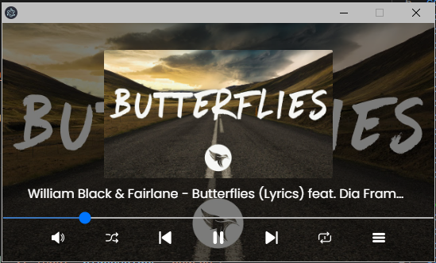
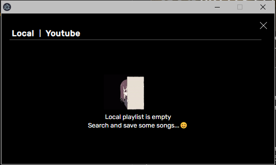
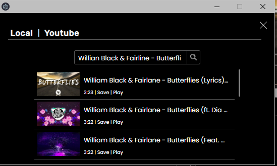

# Music Player - Electron


## About
  A music player built by using electron and innertube.js. The purpose of this project is to play and keep track of your favorite songs in local and youtube into one.

<p align="center" width="100%">
   <br>
  Player Interface
</p>

<p align="center" width="100%">
   <br>
  Local Playlist
</p>

<p align="center" width="100%">
   <br>
  Youtube Search Result
</p>

## Motivation
  Maybe I just want to challenge myself if I can built something from scratch by using my skills so far, I don't have any intention to share or promote illegal content here.

## Installation Guide
### Clone Repo
``` https://github.com/MiDo781/Music-Player_-_Electron.git ``` and go to the directory. <br>
> Add a folder in  ```src``` named ```music``` to store your saved songs.

> Make sure that you have node installed, LTS updated version is recommended.

### Install dependencies
Just type ``` npm install ``` and it will download the necessary dependencies info. on package.json 

### Launch Application
Just type ``` npm start ``` to run the application.